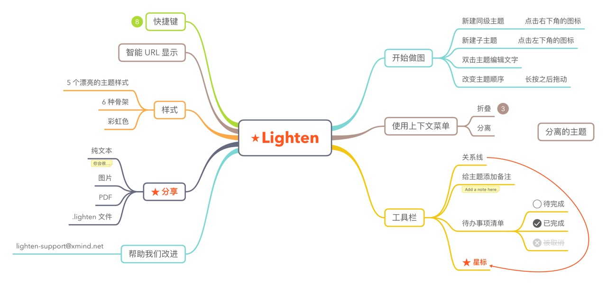

# iOS 开放工程题
参照下图，利用你所知晓的技术在 iOS 平台上编写出一个 Demo，该 Demo 需要实现思维导图的**基本功能**。

基本功能为你认为思维导图中最重要的功能，可以忽略界面中的线条、线框、字体、颜色等元素，并在项目的 README 文件中说明该 Demo 所能提供的功能列表。

---- 

1. 请将你的代码和所有其他内容以云盘或者github链接的形式发送到 [hr@xmind.net](mailto:hr@xmind.net)。
2. 请附带上你的简历，其中必须包含以下联系方式信息：
	- 电子邮箱地址
	- 电话号码
3. 请不要在代码中包含任何依赖库文件或可执行文件。