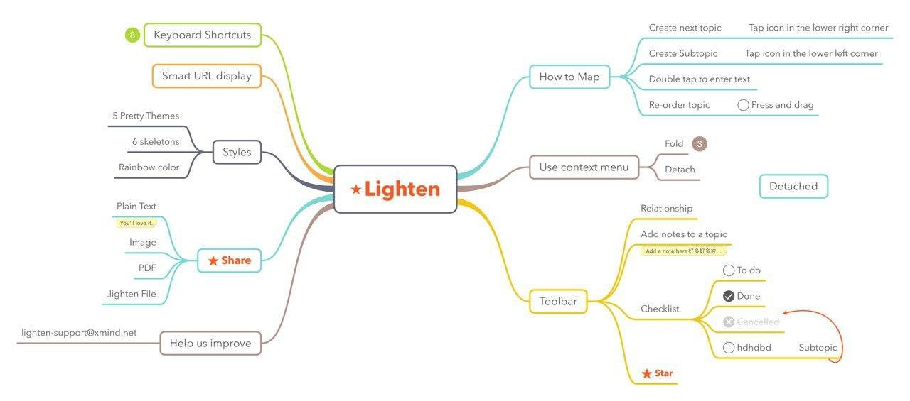

# Assignment for Candidates of iOS Developer

The image below is a mind map which is a reference for this assignment. The assignment is to develop a demo for iOS with basic features of a mind map. There will be no tech stack limits for this assignment.

Write those functions that you think they matter most. Elements such as, lines, topic shape font, colors, etc. can be neglected. Explain the functions in README documentation.

---

1. Please archive the assignment (code and all the other content), and send to hr@xmind.net by cloud disk or github link.
2. Please attach your resume with the information below:

   - Email Address

   - Phone Number

3. Please do not include any dependent libraries or executable file in your code.